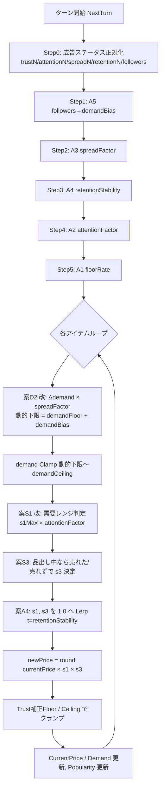

# TomsShop 経済システム 仕様書

## 1. 概要

本ドキュメントは TomsShop の **価格・需要更新ロジック** と、広告ステータス
（Trust / Attention / Spread / Retention / Followers）が経済シミュレーションに
どう作用するかをエンジニア / プランナー向けに整理したものです。

- **対象クラス**
  - `Assets/Scripts/TomsShop/ShopEconomySettings.cs` — 全パラメーター(ScriptableObject)
  - `Assets/Scripts/TomsShop/ItemModel.cs` の `ApplyShopTurnEconomy(...)` — 計算本体
  - `Assets/Scripts/Marketing/ShopStatusModel.cs` — 広告ステータスの保持
- **設計方針**: **役割分担方式** — 各広告ステータスは異なるフェーズに作用し、
  機能が直交する。広告投資 → 需要 → 価格の連鎖が成立する。
- **互換性方針**: 各係数を 0 にする、または `ShopStatusModel` を渡さない場合、
  本機能導入前の挙動と **完全一致** する。

---

## 2. 用語

| 用語 | 定義 |
|---|---|
| Demand | アイテムの需要(0.05〜1.0)。販売数と価格率に作用 |
| Trust | 信頼度(0〜100)。Floor 倍率を底上げ |
| Attention | 注目度(0〜100)。S1 上振れ増幅 |
| Spread | 拡散力(0〜100)。D2 需要変動増幅 |
| Retention | 顧客維持力(0〜100)。S1/S3 を 1.0 へ寄せる |
| Followers | フォロワー数(0〜∞)。需要下限を底上げ |
| S1 | 需要連動価格変動(highDemand / normalDemand / lowDemand の3レンジ) |
| S3 | 品出し販売結果フィードバック(売れた / 売れず) |
| D1 | 戦闘結果の属性波及(本ドキュメント外。`ApplyBattleAttributeSpread`) |
| D2 | 品出し陳列による需要変動(displayDemandUp / notDisplayDemandDown) |
| A1〜A5 | 広告ステータス連動(本ドキュメントで新設) |

---

## 3. 価格更新フロー

---

## 4. 広告ステータス × 作用フェーズ早見表

| ステータス | 作用フェーズ | 数式 | 既定係数 | MAX(=100, F=1000) 時の効果 |
|---|---|---|---|---|
| **Trust** | Floor クランプ | `floor = basePrice × (shopPriceFloorRate + trustFloorBoost × Trust/100)` | `trustFloorBoost = 0.4` | Floor 30% → 70%(= basePrice × 0.7 で下げ止まり) |
| **Attention** | S1 上限 | `s1Max ×= 1 + attentionPriceAmplify × Attention/100` | `attentionPriceAmplify = 0.5` `attentionAffectsLowDemand = false` | high/normal の s1Max が 1.5×。例: 1.03 → 1.545 |
| **Spread** | D2 倍率 | `Δdemand ×= 1 + spreadDemandAmplify × Spread/100` | `spreadDemandAmplify = 1.0` | +0.02 → +0.04 / −0.01 → −0.02 |
| **Retention** | S1/S3 安定化 | `s1 = Lerp(s1, 1, retentionStabilizer × Retention/100)` `s3 = Lerp(s3, 1, retentionStabilizer × Retention/100)` | `retentionStabilizer = 0.6` | 例: 1.05 → 1.02 / 0.97 → 0.988 |
| **Followers** | 需要下限 | `dynFloor = demandFloor + followerWeight × Log10(1 + Followers/followerScale)` | `followerWeight = 0.1` `followerScale = 1000` | F=1000 で下限 +0.030, F=10000 で +0.104 |

> **note**: `attentionAffectsLowDemand` を `true` にすると低需要レンジの max(値下げ
> 緩和側)も増幅され、注目時は値下げが小さくなる。デフォルトは false で「注目=値上げ
> 強化」のみに限定。

---

## 5. ShopEconomySettings 全フィールド早見表

### 5.1 既存(従来から存在)

| カテゴリ | フィールド | 既定値 | 説明 |
|---|---|---|---|
| 案S1 | `highDemandThreshold` | 0.7 | 人気判定の Demand 閾値 |
| 案S1 | `highDemandPriceRateMin` / `Max` | 1.01 / 1.03 | 人気商品のターン価格率 |
| 案S1 | `lowDemandThreshold` | 0.3 | 不人気判定の Demand 閾値 |
| 案S1 | `lowDemandPriceRateMin` / `Max` | 0.97 / 0.99 | 不人気商品のターン価格率 |
| 案S1 | `normalDemandPriceRateMin` / `Max` | 0.99 / 1.01 | 中間 Demand のターン価格率 |
| 案S3 | `soldPriceRateMin` / `Max` | 1.01 / 1.02 | 売れた時の価格率 |
| 案S3 | `unsoldPriceRateMin` / `Max` | 0.98 / 0.99 | 売れなかった時の価格率 |
| 価格上下限 | `shopPriceFloorRate` | 0.3 | 元値に対する下限倍率 |
| 価格上下限 | `shopPriceCeilingRate` | 3.0 | 元値に対する上限倍率 |
| 案D1 | `victoryAttributeDemandUp` | 0.05 | 勝利時の同属性需要 UP |
| 案D1 | `defeatAttributeDemandDown` | 0.05 | 敗北時の同属性需要 DOWN |
| 案D2 | `displayDemandUp` | 0.02 | 品出し中の需要 UP/ターン |
| 案D2 | `notDisplayDemandDown` | 0.01 | 品出し外の需要 DOWN/ターン |
| 需要上下限 | `demandFloor` | 0.05 | 需要の最小値 |
| 需要上下限 | `demandCeiling` | 1.0 | 需要の最大値 |

### 5.2 新規(広告ステータス連動)

| カテゴリ | フィールド | 既定値 | 説明 |
|---|---|---|---|
| 案A1 | `trustFloorBoost` | 0.4 | Trust=100 で Floor に加算される倍率 |
| 案A2 | `attentionPriceAmplify` | 0.5 | Attention=100 で s1Max を増幅する追加倍率 |
| 案A2 | `attentionAffectsLowDemand` | false | low 需要レンジの max にも増幅を適用するか |
| 案A3 | `spreadDemandAmplify` | 1.0 | Spread=100 で Δdemand を何倍にするかの追加分 |
| 案A4 | `retentionStabilizer` | 0.6 | Retention=100 で価格率を 1.0 へ寄せる Lerp の t 強度 |
| 案A5 | `followerWeight` | 0.1 | Followers の対数スケール強度 |
| 案A5 | `followerScale` | 1000 | Followers の対数スケール基準 |

---

## 6. Followers の効果モデル(設計判断メモ)

`Followers` は「**毎ターン demand に加算**」ではなく「**動的下限の底上げ**」を採用。

- 採用案: `dynamicDemandFloor = Min(demandFloor + demandBias, demandCeiling)`
- 不採用案: `demand += demandBias`(毎ターン加算)

**理由**: 毎ターン加算は demand が線形に上昇し続け、`demandCeiling=1.0` に貼り付いて
インフレが収束しない。一方で「動的下限」モデルでは:

- フォロワーが増えると需要の **下限が上がる**(底堅さ)
- 通常の `Δdemand` は普通に効くので、品出ししなければ下がるが、**下げ止まり水準**が上がる
- 「固定客が常に一定数の需要を下支えする」というゲーム的意味と整合
- 平衡点が `dynamicDemandFloor` 〜 `demandCeiling` の間に収束する

毎ターン加算式に切り替える場合は、`ItemModel.ApplyShopTurnEconomy` 内で
`runtime.Demand.Value + deltaDemand` を `+ demandBias` 分だけ追加するだけで切替可能。

---

## 7. チューニングガイド(レシピ集)

### 価格を全体的に底上げしたい
→ `trustFloorBoost` を上げる(0.4 → 0.6)、または `shopPriceFloorRate` 自体を 0.4
あたりまで上げる。Trust が低い序盤でも効かせたい場合は後者。

### バズ時の盛り上がりを大きくしたい
→ `spreadDemandAmplify`(1.0 → 1.5)と `attentionPriceAmplify`(0.5 → 0.8)を
セットで上げる。需要・価格の両面で広告ターンの伸びが顕著になる。

### 価格変動が激しすぎる(プレイヤーが安定して売り買いしたい)
→ `retentionStabilizer` を 0.7〜0.9 に上げる、または S1/S3 のレンジ自体を
`±0.005` 程度に狭める。

### フォロワーの効果を強くしたい(固定客の影響を強調)
→ `followerWeight` を 0.15〜0.2 に上げる、または `followerScale` を 500 に下げる。
小さい followerScale は「序盤のフォロワー数で大きく効く」設計。

### 広告効果を完全に無効化したい(従来挙動に戻す)
→ 以下を全て 0 にする:
- `trustFloorBoost = 0`
- `attentionPriceAmplify = 0`
- `spreadDemandAmplify = 0`
- `retentionStabilizer = 0`
- `followerWeight = 0`

---

## 8. 検証手順(Editor)

### リグレッション(従来挙動互換)
1. `ShopStatusModel` の Trust/Attention/Spread/Retention=0、Followers=0 にして
   ターンを 5 進める。価格・需要のログ値が改修前と毎ターン同等(同 seed なら同値)。
2. `GameFlowManager` のコンストラクタに渡す `shopStatusModel` を一時的に null
   差し替えしてもターン進行が例外なく完走する。
3. 5 系統の係数(`trustFloorBoost` 等)をすべて 0 に設定し、ステータス MAX +
   Followers 10000 に設定 → 上記 1 と一致する(中性化の確認)。

### 個別効果確認(`ShopStatusModel` を Editor で手動編集)
| ID | 設定 | 期待ログ |
|---|---|---|
| T-1 | Trust=100, basePrice=100 のアイテムを暴落させる | `floor=70`(= 100 × 0.7) で下げ止まる |
| T-2 | Attention=100 | `[ShopEconomy] ... (Att×1.50, Ret t=0.00) ...` のログ確認、s1 が 1.5× で記録される |
| T-3 | Spread=100, 品出し中アイテム | `spread×2.00`、Δdemand が ±0.04 / ±0.02 |
| T-4 | Retention=100 | s1Rate が 1.0 ± 0.012 程度に圧縮 |
| T-5 | Followers=10000, 品出し停止 | demand が `demandFloor + 0.104 ≈ 0.154` で下げ止まる |

### ヌル安全性
- `Followers < 0`、`followerScale = 0`、`Trust = int.MinValue` 等の境界値で
  例外が出ないこと(`Max(0,…)` / `Max(1,…)` / `Clamp01` でガード済み)。

---

## 9. 影響ファイル(本機能で改修済み)

| ファイル | 改修内容 |
|---|---|
| `Assets/Scripts/TomsShop/ShopEconomySettings.cs` | A1〜A5 の 7 フィールド追加 |
| `Assets/Scripts/TomsShop/ItemModel.cs` | `ApplyShopTurnEconomy` のシグネチャ拡張(status 引数追加)と内部ロジック書き換え |
| `Assets/Scripts/GameFlow/GameFlowManager.cs` | フィールド `_shopStatusModel` 追加、コンストラクタ引数追加、`NextTurn()` 呼び出し変更 |
| `Assets/Scripts/Marketing/ShopStatusModel.cs` | 改修なし(参照のみ) |
| `Assets/Scripts/GameLifetimeScope.cs` | 改修なし(`ShopStatusModel` は既に Singleton 登録済み) |
